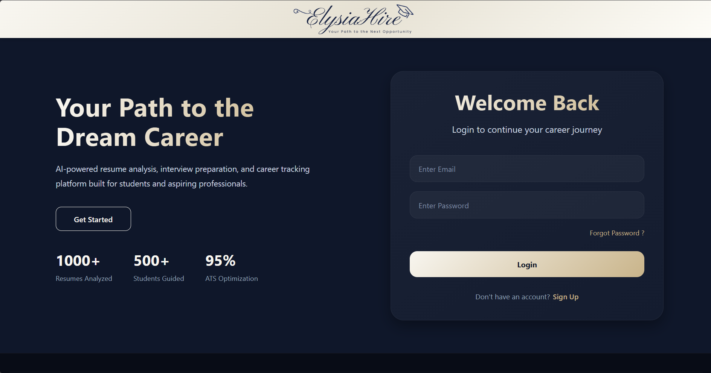
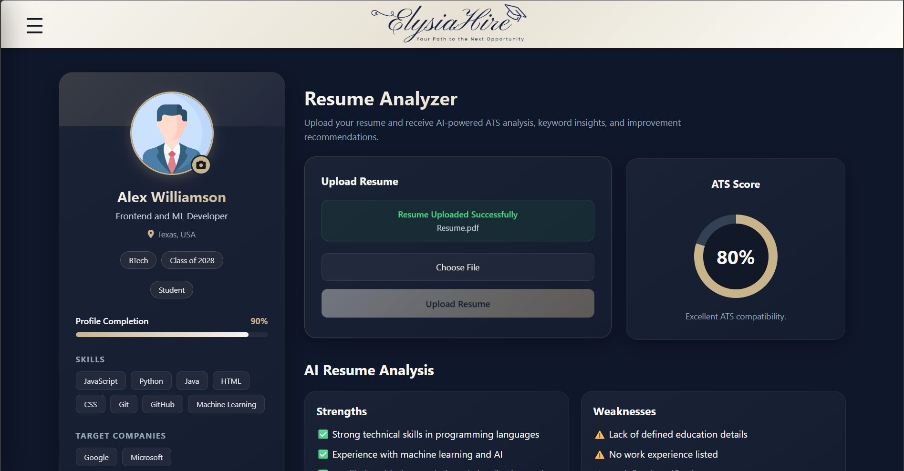

# ElysiaHire

### Your Path to the Next Opportunity

ElysiaHire is an AI-powered Resume Intelligence System that helps students, freshers, and job seekers improve their resumes through recruiter-style evaluations and actionable AI feedback.

By combining modern web technologies with Large Language Models (LLMs), ElysiaHire delivers personalized resume insights that bridge the gap between academic achievements and real-world hiring expectations.

---

## 🚀 Overview

Building an effective resume often requires multiple rounds of feedback from mentors, peers, or recruiters. However, access to personalized guidance is limited, and most ATS checkers provide generic scores without meaningful recommendations.

ElysiaHire addresses this challenge by offering intelligent, context-aware resume evaluations that help candidates understand:

* How well their resume aligns with hiring expectations
* Their strengths and weaknesses
* Missing or underrepresented skills
* Personalized recommendations for improvement
* Potential career roles suited to their profile

---

## ✨ Features

### 🔐 Authentication & Security

* Secure User Registration and Login
* JWT-based Authentication
* Password Hashing using bcrypt
* Protected Backend APIs
* Persistent User Sessions

### 📄 Resume Management

* Resume Upload System
* ImageKit-based Resume Storage
* Resume Metadata Management
* Resume Version Tracking (Latest 3 Versions)
* Resume History Management

### 🧠 AI Resume Intelligence

Powered by **Groq + Llama 3.3 70B**

* ATS-style Score Generation
* Strength Analysis
* Weakness Detection
* Missing Skills Identification
* Personalized Improvement Suggestions
* Recommended Career Roles
* Structured JSON-based Evaluations

### 📊 Interactive Dashboard

* Dynamic ATS Score Visualization
* AI-generated Resume Insights
* Skills Overview
* Resume Activity Tracking
* Personalized Dashboard Experience

---

## 📸 Screenshots

### Home Page

> 

* Modern, responsive landing experience introducing the platform.

### Authentication

> 

* Secure login and registration with JWT authentication.

### Resume Intelligence Dashboard

> 

* Resume upload workflow
* ATS score visualization
* AI-generated strengths and weaknesses
* Personalized resume insights

---

## 🛠️ Tech Stack

### Frontend

* React.js
* Vite
* JavaScript
* HTML5
* CSS3
* Axios
* React Router

### Backend

* Node.js
* Express.js
* MongoDB Atlas
* Mongoose
* JWT Authentication
* bcrypt

### AI Layer

* Groq API
* Llama 3.3 70B
* Prompt Engineering
* Structured JSON Outputs
* Resume Evaluation Pipeline

### Cloud Services

* ImageKit

### Development Tools

* Git
* GitHub
* VS Code
* Postman

---

## ⚙️ Project Architecture

The application follows a modular MVC architecture:

```bash
ElysiaHire/
├── frontend/
├── backend/
│   ├── controllers/
│   ├── middleware/
│   ├── models/
│   ├── routes/
│   ├── services/
│   └── utils/
├── README.md
└── package.json
```

---

## 📈 Development Status

| Module                        | Status         |
| ----------------------------- | -------------- |
| Authentication                | ✅ Complete     |
| Backend APIs                  | ✅ Complete     |
| Resume Upload                 | ✅ Complete     |
| Resume Version Tracking       | ✅ Complete     |
| Resume Intelligence Dashboard | ✅ Complete     |
| AI Resume Evaluation          | ✅ Complete     |
| Frontend UI                   | ✅ Complete     |
| Deployment                    | 🚧 In Progress |

---

## 🔐 Environment Variables

```env
MONGODB_URI=
JWT_SECRET=
IMAGEKIT_PUBLIC_KEY=
IMAGEKIT_PRIVATE_KEY=
IMAGEKIT_URL_ENDPOINT=
GROQ_API_KEY=
PORT=5000
```

---

## 🎯 Project Goal

The goal of ElysiaHire is to democratize access to high-quality resume feedback by providing every candidate with personalized, recruiter-style insights that improve placement readiness and confidence.

---

## 🔮 Future Enhancements

Potential future directions include:

* AI-powered Mock Interviews
* Adaptive Interview Feedback
* Skill Gap Analysis
* Personalized Career Roadmaps
* Career Growth Tracking
* Resume Comparison Analytics

These enhancements represent the broader vision of ElysiaHire and are not part of the current v1 release.

---

## 👨‍💻 Author

**Shivam Pawar**

Building AI systems that make career preparation more accessible, personalized, and effective.

---

## 📌 Current Status

🚀 **ElysiaHire v1.0.0 — Working AI Resume Intelligence System**

Features include end-to-end resume analysis, ATS scoring, personalized feedback generation, resume version tracking, and an interactive dashboard experience.
